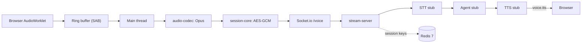
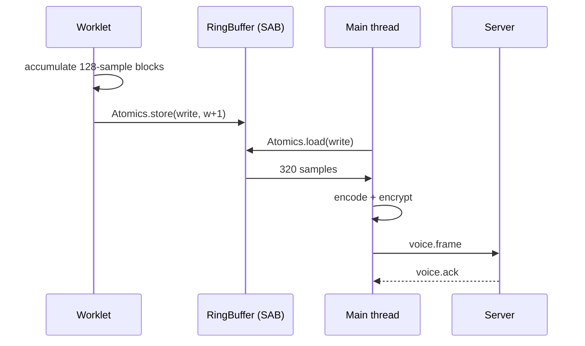
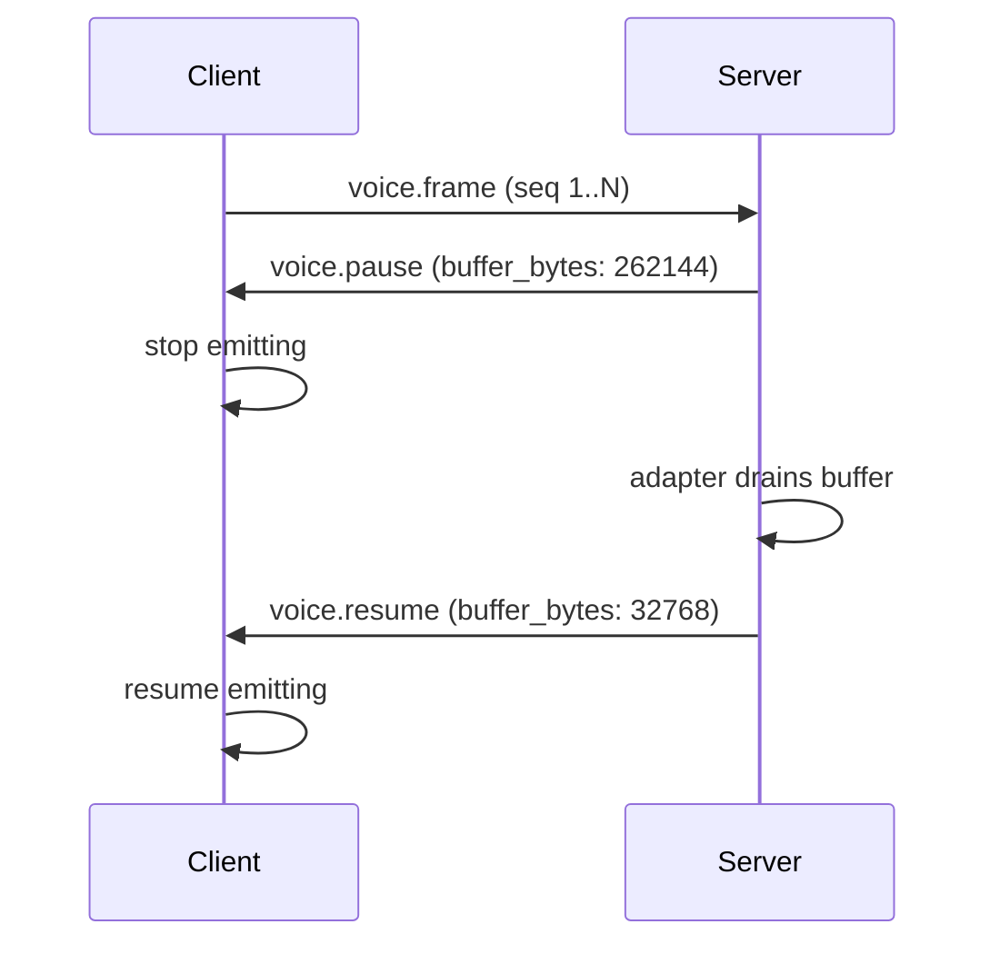

# realtime-voice-infra

Production-grade transport layer for voice agents: AudioWorklet capture,
backpressure-aware Socket.io streaming, and session-scoped encryption.


Voice-AI teams routinely under-invest in the transport layer — treating it as
solved plumbing — until they hit buffer overruns under load, silent IV
collisions in encrypted sessions, or AudioContext sample-rate mismatches that
corrupt every downstream transcript. This repository documents the patterns
that prevent those failures, packaged as a runnable monorepo you can fork
rather than rediscover.

## Architecture



## Why Socket.io and not WebRTC

An honest trade-off. We picked Socket.io deliberately:

- **Latency.** WebRTC ICE + DTLS adds 200–500 ms of setup. Socket.io connects
  in one HTTP upgrade round-trip.
- **Complexity.** No STUN/TURN, no SDP negotiation, no codec negotiation.
  Irrelevant for half-duplex agent sessions.
- **Backpressure.** Socket.io lets the server observe the send queue directly
  and drive the client's `voice.pause`/`voice.resume` protocol. RTCP was
  designed for video conferencing, not server-side buffer management.
- **Operations.** Plain HTTP tooling works. No `chrome://webrtc-internals`.

**Choose WebRTC instead when** you need full-duplex sub-100 ms audio, P2P, or
multi-party. LiveKit and Daily are better fits for those cases.

## Quickstart

```bash
yarn install
docker compose up          # Redis, stream-server
yarn workspace @realtime-voice-infra/voice-client start
# Open http://localhost:4200, grant mic permission.
```

## AudioWorklet pipeline

The Web Audio API hands the worklet 128-sample blocks. We accumulate into
320-sample (20 ms @ 16 kHz) frames — Opus's recommended minimum — and write
them to a `SharedArrayBuffer` ring buffer. The main thread polls the buffer
on `requestAnimationFrame`, encodes, encrypts, and emits. See
`apps/voice-client/public/worklets/capture-processor.js` and
`apps/voice-client/src/app/ring-buffer.ts`.



## Backpressure



Unbounded ingest queues are the #1 voice-infra OOM mode. The pause trigger is
conservative (256 KB) so even a slow STT adapter does not force us into a
drop-the-oldest policy. See `.context/backpressure.md`.

## Adapt this to your stack

| Stub | Real integration | Notes |
|---|---|---|
| EchoSTT | Deepgram `LiveClient` | Stream decrypted PCM; map `transcript` events |
| SilenceTTS | ElevenLabs streaming | Yield PCM as `Float32Array[320]` frames |
| EchoAgent | OpenAI `chat.completions` | Pass final transcript as user message |

Adapters live in `apps/stream-server/src/adapters/`. They are not wired into
the router by default — integrate them explicitly in `session-router.ts`.

> **COOP/COEP.** `SharedArrayBuffer` requires cross-origin isolation. Every
> page serving the voice-client **must** send:
>
> ```
> Cross-Origin-Opener-Policy: same-origin
> Cross-Origin-Embedder-Policy: require-corp
> ```
>
> The Angular dev server sets both (`apps/voice-client/angular.json`). In
> production, configure your reverse proxy to match.

## Non-goals

- Not a full voice agent. Stubs prove interfaces; no STT/LLM/TTS is bundled.
- Not a media-server replacement. No SFU, no multi-party conferencing.
- Not a WebRTC implementation.
- Not a production deployment guide. `docker-compose.yml` is for local dev.

## License

MIT.
